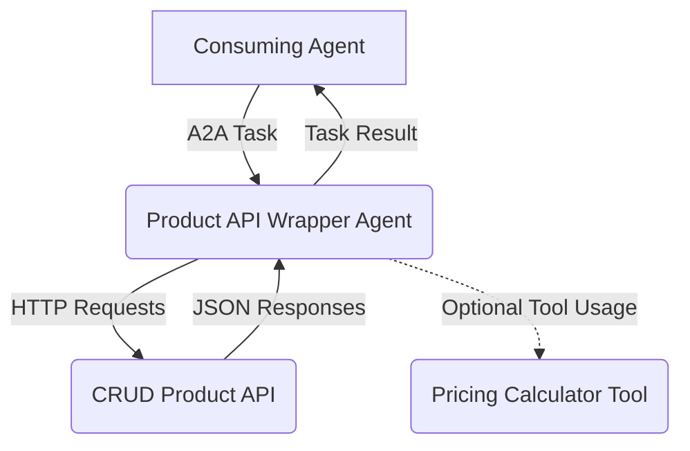
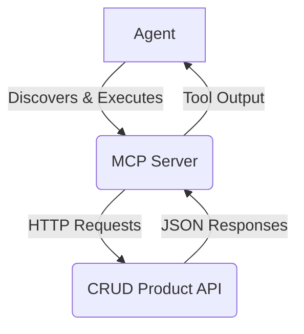

# How should AI Agents Integrate with Existing APIs?

```
Ongoing work. Issues to be fixed:
- [ ] Code examples have room for improvement
```

## Introduction
In the world of enterprise IT with a network of hundreds or thousands of applications and microservices, APIs are the essential connective tissue that allows disparate systems to communicate, share data, and trigger actions. As Jeff Bezos famously mandated at Amazon, every piece of functionality should be designed to be exposed through an API [1]. This principle has become a cornerstone of modern software architecture.

In recent months, a new architecture paradigm seems to be emerging: agentic AI. Agents as autonomous software entities, powered by large language models (LLMs), promise to revolutionize how we build and interact with IT systems. Although still largely aspirational, proponents of agentic AI make a compelling case: Agents can understand natural language as powerful and flexible way of expressing intents, reason about complex problems, and execute multi-step tasks. This raises a critical question for every software and IT architect: how do we integrate agents with the vast ecosystem of existing systems through their APIs? Simply rebuilding all established, often complex and well-working systems is not an option and integrating agents with systems will be critical for the success of agents.

## Product System Case Study
This article explores two approaches for bridging the gap between agents and APIs, using a simple case study. 

Let's assume we have a standard application for managing a product catalog. It exposes basic CRUD endpoints:
- `GET /products/{product_id}`: Retrieve a product.
- `POST /products/`: Create a new product.
- `PUT /products/{product_id}`: Update a product.
- `DELETE /products/{product_id}`: Delete a product.

Our goal is to make this simple API accessible to agents.

## Approach 1: The API Wrapper Agent
The first approach is to wrap the existing API with a dedicated agent. This "wrapper agent" acts as an intelligent façade, making the API more flexible and conversational. It can understand nuanced requests, handle complex error scenarios, and manage state across multiple interactions.

Imagine a user asking, "That last product I added, can you increase its price by 10%?". A simple API call can't handle this. It requires memory (what was the last product?) and logic (calculate the new price). A wrapper agent is perfect for this.

### Overview
Here’s a high-level architectural overview of the design:



### Sample implementation

#### Agent Definition (using Google’s Agent Development Kit - ADK)

This agent understands how to interact with the Product API. It maintains a (in this example very basic) memory of its interactions to handle conversational context.

```python
from google.adk import Agent
from a2a.schema import AgentCard
from product_api_client import ProductAPIClient

class ProductAPIAgent(Agent):
    def __init__(self):
        super().__init__()
        self.api_client = ProductAPIClient()
        self.last_added_product_id = None # in a real-world example this would likely be session based

    def handle_create_product(self, name: str, price: float):
        """Creates a new product and remembers its ID."""
        try:
            product = self.api_client.create_product(name=name, price=price)
            self.last_added_product_id = product.get('id')
            return f"Successfully created product '{name}' with ID {product['id']}."
        except Exception as e:
            return f"Error creating product: {e}"

    def handle_update_price(self, percentage_increase: float):
        """Updates the price of the most recently added product."""
        if not self.last_added_product_id:
            return "I don't have a record of the last product added."
        try:
            product = self.api_client.get_product(self.last_added_product_id)
            new_price = product['price'] * (1 + percentage_increase / 100) # this could also be done using a dedicated tool
            self.api_client.update_product(self.last_added_product_id, price=new_price)
            return f"Updated product {self.last_added_product_id}'s price to CHF {new_price:.2f}."
        except Exception as e:
            return f"Error updating product: {e}"

# update agent card (defined in JSON)
agent_card = AgentCard(
    name="Product Manager Agent",
    description="An agent that wrapps the Product API",
    version="1.0.0",
    endpoint="https://agent-endpoint.com/a2a",
    skills=[
        AgentSkill(
            name="update_last_product_price",
            description="Updates the price of the most recently added product"
        ),
        AgentSkill(
            name="create_product",
            description="Creates a new product and remembers its ID."
        )
    ]
)
```

#### Agent-to-Agent Server

This simple server routes A2A requests [2] to the agent. The consumer agent sends a message intended for the `ProductAPIAgent`, and the server ensures it gets there.

```python
from product_api_agent import ProductAPIAgent
from a2a.server import A2AServer

# Create an agent server
agent = ProductAPIAgent()

a2a_server = A2AServer(
    agent=agent,
    agent_card=agent_card,
    host="localhost",
    port=8000
)

a2a_server.start()
```

#### Agent-to-Agent (A2A) Client

The consumer agent (in the example an A2A Client) doesn't need to know about the structure of the wrapped API. It just communicates its intent to the `ProductAPIAgent`.

```python
from a2a.client import A2AClient
from a2a.schema import TaskRequest

# Create an A2A client
client = A2AClient()

# Discover an agent by its URL
agent_card = a2a_client.discover("https://another-agent.com/.well-known/agent.json")


# 0) Try to update a product before one has been created.
# The agent uses its memory and correctly reports that it can't perform the action.

# Create a task request
price_increase_task_request = TaskRequest(
    skill="update_last_product_price",
    inputs={"percentage_increase": 10}
)

# Send a task to the agent
task0 = a2a_client.create_task(
    agent_url=agent_card.endpoint,
    task_request=price_increase_task_request
)

# Get the task result, the agent provides a error response
result0 = a2a_client.wait_for_task_result(task0.id)
print(result0) #> I don't have a record of the last product added.

# 1) Now, create a product

# Create a task request
create_product_task_request = TaskRequest(
    skill="create_product",
    inputs={"name": "Dark Cloud Running Shoe", "price": 99.99}
)

# Send a task to the agent
task1 = a2a_client.create_task(
    agent_url=agent_card.endpoint,
    task_request=create_product_task_request
)

# Get the task result
result1 = a2a_client.wait_for_task_result(task1.id)
print(result1) #> Successfully created product 'Dark Cloud Running Shoe' with ID 12345.

# 2) Now, the agent remembers the last product.

# Get the task result
result2 = a2a_client.wait_for_task_result(task0.id)
print(result2) #> Updated product 12345's price to CHF 109.99.
```

### Additional Considerations for this Approach

#### OAS as starting point

Many enterprises already publish a comprehensive OpenAPI (formerly Swagger) spec for their REST services and AsyncAPI Specs for asynchronous APIs.  While defining the code for the agent might look like significant work and its it not yet clear how versioning would work, it is likely that options will become available that allow the generation and updating of agents based on OpenAPI Specs.

## Approach 2: The MCP Server as a Tool Provider

The second approach is to expose the API as a "tool" that any authorized agent can use. Here, the Model Context Protocol (MCP [3]) from Antropic is used. The MCP Server acts as a standard approach for accessing the tool - in this case, the API. It doesn't add conversational intelligence itself but provides a standardized way for agents to discover and execute functions. 

### Overview

Again a high-level overview of the architecture:



### Sample implementation

#### MCP Server Definition

```python
# mcp_server.py
from product_api_client import ProductAPIClient

class MCPServer:
    def __init__(self, tools):
        self.tools = tools

    def execute_tool(self, name, **kwargs):
        for tool in self.tools:
            if tool["function"]["name"] == name:
                return tool["callable"](**kwargs)
        raise ValueError(f"No such tool: {name}")

# Define API client and tools
api_client = ProductAPIClient()

tools = [
    {
        "type": "function",
        "function": {
            "name": "get_product",
            "description": "Get a product by its ID",
            "parameters": {
                "type": "object",
                "properties": { "product_id": { "type": "string" } },
                "required": ["product_id"],
            },
        },
        "callable": api_client.get_product,
    },
    {
        "type": "function",
        "function": {
            "name": "create_product",
            "description": "Create a new product with a name and price",
            "parameters": {
                "type": "object",
                "properties": {
                    "name": { "type": "string" },
                    "price": { "type": "number" },
                },
                "required": ["name", "price"],
            },
        },
        "callable": api_client.create_product,
    },
    # ... add other tools
]

# Instantiate MCPServer
mcp_server = MCPServer(tools=tools)
```

#### Agent Consuming the Tool

The agent is configured to use the tools from the MCP Server. When given a task, its underlying LLM determines which tool to call and with what parameters.

```python
from mcp_server import mcp_server
from llm_client import LLMClient # Hypothetical client for an LLM

mcp_server = MCPServer(tools=tools)

# The LLMClient is configured with the tools from the MCP Server
llm_client = LLMClient(tools=mcp_server.tools)

prompt = "Please create a product called 'Dark Cloud Running Shoe' that costs CHF 150."

# The LLM processes the prompt and determines it needs to call a tool
response = llm_client.chat(prompt)

# The response indicates a tool call is needed
if response.tool_calls:
    tool_call = response.tool_calls[0]
    function_name = tool_call.function.name # "create_product"
    function_args = tool_call.function.arguments # {"name": "Dark Cloud Running Shoe", "price": 150}
    
    # Find the corresponding callable function and execute it
    tool_output = mcp_server.execute_tool(function_name, **function_args)
    
    # The agent would then process the output
    print(tool_output) #> {'id': '67890', 'name': 'Dark Cloud Running Shoe', 'price': 150}
```

### Additional Considerations for this Approach

#### OAS as starting point

An MCP Server can already dynamically ingest OAS at startup (or even at runtime) to auto-generate fully typed tool definitions—complete with parameter validation, schemas, and example requests — eliminating the need to hand-code each intent in an ADK (Agent Development Kit). This not only speeds onboarding of new APIs but also ensures parity with the official service contract, reducing drift and manual errors.

#### Function-Calling APIs

As a lightweight alternative to a full MCP, “function-calling” support—now built into major LLM offerings like OpenAI’s Chat Completions API—lets you declare JSON-schema-based function signatures inline with your prompt. The model then selects and populates the appropriate function call. While it doesn’t offer a centralized registry or advanced orchestration features, it provides many of the same benefits (strict typing, auto-extraction of parameters) directly within the LLM client, making it a compelling middle ground between raw prompt engineering and a heavyweight MCP deployment.


## Comparison

### High Level Comparison
Let's now compare the two approaches:

| **Dimension** | **API Wrapper Agent Approach** | **MCP Server / Tool Approach** |
| :--- | :--- | :--- |
| **🧠 Autonomy** | **High**. The agent can manage complex, multi-step workflows, make decisions, and retry failed operations on its own. | **Low**. The agent primarily performs direct function calls through the tool. Autonomy is limited to the LLM's ability to sequence tool calls. |
| **🧩 Complexity** | **High**. Requires developing and maintaining a stateful, intelligent agent in addition to the underlying API. | **Low**. Simpler to implement. It mainly involves creating a tool based on existing documentation (e.g., OpenAPI spec). |
| **⚡ Performance** | **Slower**. Typically requires multiple model calls: one to understand the intent and another to formulate the final response. | **Faster**. Typically requires only one model call to determine which tool to use. The rest is a direct, fast API call. |
| **💰 Costs** | **More expensive**. Typically requires multiple model calls leading to a higher token count. | **Less expensive**. Typically requires only one model call with likely a lower token count. |
| **🛠️ Operating Effort** | **Higher**. Running and monitoring a fleet of agents and agent servers leads to significant operational effort. | **Lower**. MCP Servers are a relatively simple, stateless application that are easier to operate and scale. |


### Comparing Additional Design Aspects
Additional considerations worth mentioning include:

| Dimension | Wrapper Agent Approach | MCP Server / Tool Approach |
| :--- | :--- | :--- |
| **Error Handling** | **Advanced**. Can provide context-specific, user-friendly error messages and execute complex recovery logic. | **Basic**. Error handling is typically passed directly from the API back to the consuming agent, which must then interpret it. |
| **State Handling** | **Inherent**. The agent is designed to be stateful, remembering past interactions to inform future actions. | **Stateless**. Each tool call is an independent, atomic operation. State must be managed by the calling/consuming agent. |
| **Security & Authorization** | **More effort** Must integrate with OAuth/OIDC, API keys, mTLS or IAM roles and enforce RBAC on each intent to prevent privilege escalation. | **Simpler**. Tools inherit the MCP Server’s auth guardrails; the server can enforce API‑key scopes or signed JWTs with minimal custom code. |
| **Rate‑Limiting, Throttling & Backoff** | **More effort**.  Agent wrappers need built‑in throttling, retries with exponential backoff and circuit breakers to respect API quotas. | **Simpler**. The MCP Server can centralize rate‑limit logic (shared across all clients) and expose standardized retry semantics. |
| **Observability & Monitoring** | **More effort**. Requires distributed tracing, structured logging and metric collection inside the agent to trace multi‑hop calls. | **Simpler**. MCP Servers can emit OpenTelemetry spans and metrics for each tool invocation, simplifying end‑to‑end telemetry. |
| **API Versioning & Compatibility** | **More effort**. Wrapper functions may break when the underlying API changes if there is no mechanism in place that updates it based on the OAS; hence this approach requires more comprehesive testing and a graceful fallback logic. | **Simpler**. Tools can already be generated from the API’s OpenAPI/AsyncAPI spec—updating the spec regenerates bindings and catches schema drift.|

## Conclusion

Agents and MCP Servers are not the new APIs. Instead, they represent a new, more intelligent layer for interacting with existing APIs. They act as sophisticated consumers and orchestrators of APIs rather than replacements for them. We have looked at two different approaches: exposing APIs as "tools" and wrapping APIs with agents.

So, which approach is most suitable? The answer, as is often the case with architectural decisions, is: it depends on the use case.

Use the API Wrapper Agent approach when the underlying task is a more complex workflow. If the process involves multiple steps, requires decisions based on intermediate results, needs to retry on failure, or benefits from conversational memory, an agent is the superior choice. It abstracts away the complexity and provides a truly intelligent interface.

Use the MCP Server / Tool approach when you need to expose simple, stateless functions and if the complexity of the underlying API is limited. If you just want an agent to be able to create a user, get a stock price, or retrieve a product by its ID, exposing the API as a tool is fast, efficient, and easy to maintain. Access to data sources via other mechanisms (e.g., directly accessing a database that has no API or a document) is an additional use case that was not covered in this article.

Finally, it's important to recognize that these two patterns are not mutually exclusive. You can create a hybrid: an intelligent agent that itself exposes a tool interface.

## References

1. [Amazon's API Mandate](https://konghq.com/blog/enterprise/api-mandate)  
2. [A2A protocol](https://www.a2aprotocol.org/de)  
3. [MCP protocol](https://modelcontextprotocol.io/introduction)